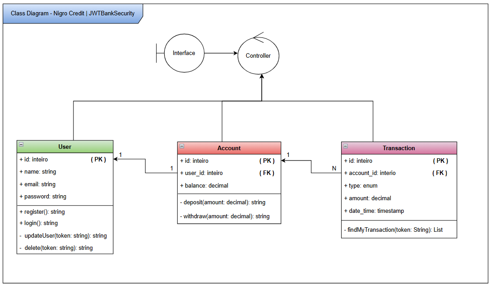
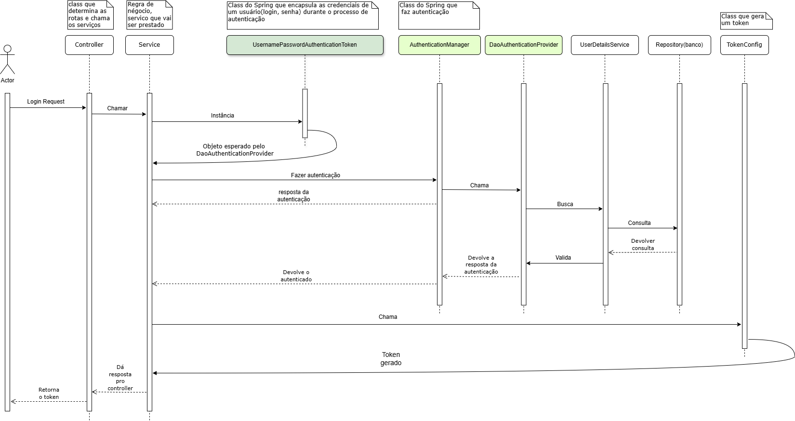

# Nigro Credit - JWTBankSecurity

---


Este projeto foi desenvolvido para aprender e aplicar conceitos de segurança aplicados a APIs, incluindo:

✔ Geração de token JWT

✔ Validação de token

✔ Filtro de segurança para proteger rotas

✔ Integração com Spring Security

---

### 🧠 Sobre o projeto

API REST desenvolvida em Java com Spring Boot que demonstra a implementação de autenticação e autorização utilizando JSON Web Tokens (JWT). O projeto simula uma aplicação bancária, permitindo o gerenciamento de usuários e operações relacionadas a contas, aplicando conceitos de segurança com Spring Security.

Funcionalidades:
- Registrar um usuário já com uma conta
- Logar um usuário e gerar um token para ele
- Realizar deposito e saque com o registro da transação
- Acessar extrato
- Acessar transações feitas na conta do usuário




🔑 Geração de Token (JWT)

O projeto possui uma classe de configuração (TokenConfig) que:
- Gera um token JWT contendo claims como userId e email
- Assina o token com uma chave secreta
- Valida o token

🔒 Filtro de Segurança

A classe SecurityFilter estende OncePerRequestFilter para:

✔ Interceptar todas as requisições HTTP

✔ Extrair o token JWT do header Authorization

✔ Validar o token e autenticar o usuário caso seja válido

✔ Continuar o fluxo da requisição para o controller

⚙️ Configuração do Spring Security

A classe SecurityConfig que é onde configuramos:
- Definimos como as requisições serão tratadas
- Quais endpoints são públicos, quais são privados
- Quais exceções se aplicam

🛠️ Dependencias usadas ( https://start.spring.io/ ): 

- PostgreSQL
- Spring Data JPA
- Spring Web
- Spring Security                      
- Spring Flyway | Controle de versão do banco de dados
- Validation | Validação de dados de entrada
- Lombok | Reduz código repetitivo (boilerplate)
- JWT :
    ```pom.xml
    <dependency>
        <groupId>com.auth0</groupId>
        <artifactId>java-jwt</artifactId>
        <version>4.4.0</version>
    </dependency>
    ```
---
Como executar e testar✅
---
1. **Clone o repositório:**

   ```bash
   git clone "https://github.com/Jullya-Nigro07/JWTBankSecurity.git"
    ```

Existem duas maniera de rodar esta aplicação:
-

---
### 1. Pelo SGBD Postgres (version 18)

I. Abra seu PostgreSQL e crie o banco:
   ```sql
   CREATE DATABASE my_users;
   ```
   
II. Abra o projeto na IDE (IntelliJ IDEA ou outra IDE compatível com Java 21)

III. No arquivo application.properties (ou application.yml), ajuste as credenciais:
```properties
   spring.datasource.url=jdbc:postgresql://localhost:5432/NOME_DO_BANCO
   spring.datasource.username=postgres
   spring.datasource.password=SUA_SENHA
  ```
   
IV. Rode a classe principal "JWTBankSecurityApplication"
     ```
    src/main/java/dio.web.JWTBankSecurity/JwtBankSecurityApllication
    ```

V. Teste as rotas no Postman, Insomnia ou via HTTP.Request do Intelliji 
    ```
   JWTBankSecurity --> 🌐request.http
    ```
---

### 2. Via docker
I. Abra seu docker

II. Configure o docker-compose da aplicação com seus dados

```bash
db:
  POSTGRES_DB: my_users
  POSTGRES_USER: postgres
  POSTGRES_PASSWORD: admadm

api:
  BD_NAME: nome_bd
  BD_USER: seu_user_bd
  BD_PASSWORD: sua_senha_bd
```


---

## 📌 Endpoints da API

> **Base URL**
>
> ```
> http://localhost:8080
> ```

---

Usuário ⤵️
--

***Criar usuário***  -> POST `/user/register`

*Body (JSON)*

```json
{
  "name": "Nome do User",
  "email": "email@gmail.com",
  "password": "senha123"
}
```

---

***Login*** -> POST `/user/login`

*Body (JSON)*

```json
{
  "email": "email@gmail.com",
  "password": "senha123"
}
```

> ⚠️ Salve o **Bearer Token** retornado no login. Ele será necessário para acessar os endpoints protegidos.

---

***Atualizar usuário*** -> PATCH `/user/updateRegister`

🔒 *Autenticação:* Bearer Token

*Body (JSON)*

```json
{
  "email": "emailNovo@gmail.com",
  "password": "senhaNova123"
}
```
> ⚠️ Envie no Body(JSON) apenas os campos que deseja atualizar.

---

***Excluir usuário*** -> DELETE `/user/deleteRegister`

🔒 *Autenticação:* Bearer Token

Sem corpo na requisição.

---

Conta ⤵️
--

***Consultar saldo*** -> GET `/account/extract`

🔒 *Autenticação:* Bearer Token

---

***Depositar*** -> POST `/account/deposit`

🔒 *Autenticação:* Bearer Token

*Body (JSON)*

```json
{
  "amount": 100.00
}
```

---

***Sacar*** -> POST `/account/withdraw`

🔒 *Autenticação:* Bearer Token

*Body (JSON)*

```json
{
  "amount": 100.00
}
```

---
Transações ⤵️
--

***Listar transações*** -> GET `/transaction`

🔒 *Autenticação:* Bearer Token

---

Autenticação ⤵️
--

Todos os endpoints protegidos utilizam **Bearer Token**.

*No Postman:*

```
Authorization
├── Type: Bearer Token
└── Token: <token obtido no login>
```

---

### 📉 Diagrama de sequencia (UML) - Login

-Faça o download da imagem que está na pasta "img/" para melhor visualização



